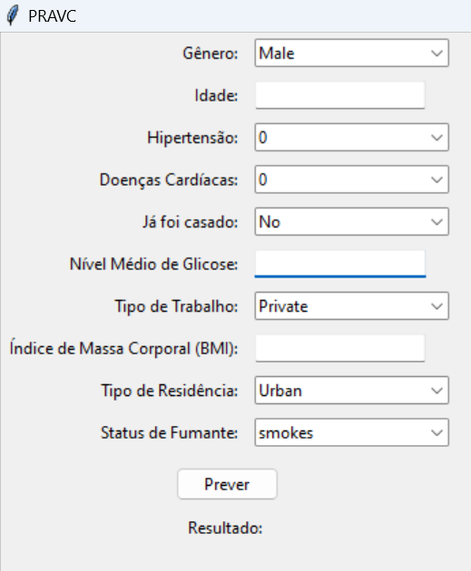

        

# PRAVC: Prevendo e Previnindo o AVC

**Grupo:** Quatro Cientistas e Um Algoritmo
 
**Integrantes:** Bruno Ferreira Brischi, Cauê Gomes Correia dos Santos, Gabriela Frajtag, Karla Rovedo Pascoalini
 
**Instituição:** Ilum - Escola de ciência
 
## Apresentação

O PRAVC é um trabalho final de _Machine Learning_, disciplina ministrada por Daniel Roberto Cassar na [Ilum - Escola de Ciências](https://ilum.cnpem.br). Assim, o objetivo desse projeto foi explorar um _dataset_ retirado do [Kaggle](https://www.kaggle.com/datasets/fedesoriano/stroke-prediction-dataset) com atributos relacionados a Acidente Vascular Cerebral (AVC), de forma a testar alguns modelos preditivos e observar se algum deles pode ser usado de forma eficiente para prever a ocorrência de AVC em algum indíviduo. 
 
Com isso em mente, decidimos testar três modelos: KNN (K-Nearest Neighbors) classificador, floresta aleatória e árvore de decisão. Com uma seção dedicada a apresentação, execução e resultado de cada modelo.

## Motivação
O Acidente Vascular Cerebral (AVC), também conhecido como derrame, é uma condição médica crítica que ocorre quando o suprimento de sangue para uma parte do cérebro é interrompido, resultando em danos aos tecidos cerebrais. Segundo o [Ministério da Saúde Brasileiro](https://www.gov.br/saude/pt-br/assuntos/saude-de-a-a-z/a/avc), AVC é uma das principais causas de morte, incapacitação e internações em todo o mundo. Fatores como hipertensão, doenças cardíacas, diabetes, tabagismo e estilo de vida sedentário, estão associados ao aumento da probabilidade do AVC ocorrer. Portanto, a prevenção e a identificação precoce de indivíduos em risco são fundamentais para reduzir o impacto do AVC na saúde pública.

## Requisitos

Para utilizar o modelo que desenvolvemos, é necessário que o usuário tenha o Python instalado e as respectivas bibliotecas: `seaborn`, `pandas`, `numpy`, `matplotlib`, `sklearn`, `tkinter` e `optuna`.  Além disso, é necessário que o usuário tenha um hardware capaz de rodar o Python e as bibliotecas.

## Bibliotecas

- **Matplotlib/Seaborn**: Foram as bibliotecas utilizadas para a visualização estatístic, principalmente na parte inicial de exploração dos dados, mas também para o plot de matrizes de confusão, que ajudam a compreensão de cada modelo.
  
- **Pandas**: Biblioteca usada principalmente para manipulação e análise dos dados e dataframe. 

- **NumPy**: Biblioteca usada para a manipulação de arrays.

- **Scikit-learn**: A biblioteca de aprendizado de máquina que foi usada para fazer os modelos de classificação.

- **Tkinter**: Biblioteca usada para criar a interface gráfica do programa, que recebe os dados do usuário e retorna o output dado pelo modelo de

- **Optuna**: Biblioteca foi usada pro tuning de hiperparâmetros, buscando a configuração para melhor desempenho dos modelos.

## Como utilizar
O código está organizado em um notebook do Jupyter, uma ferramenta interativa que permite a combinação de texto explicativo, código executável e visualizações em um único ambiente. Certifique-se de ter o Jupyter Notebook instalado para melhor interação.

No notebook, os modelos estão implementados em seções distintas, cada uma dedicada a um modelo específico (KNN, Floresta Aleatória e Árvore de Decisão). Você pode observar o código, os resultados e as visualizações geradas para cada modelo.

Para executar o código, basta rodar as células uma a uma. Certifique-se de seguir a ordem das células para evitar erros. A célula que contém o encoder, responsável por transformar dados categóricos, deve ser executada apenas uma vez. Se ocorrer algum erro durante a execução, reiniciar o kernel e rodar novamente pode ser uma solução eficaz.

## Prevenção: A importância de cada atributo
A análise do modelo de Floresta Aleatória que desenvolvemos para prever casos de AVC revelou não apenas uma ferramenta eficaz para prever possíveis AVC, mas também é possível extrair informações valiosas sobre a prevenção do AVC. Ao explorar o a importância de cada atributo, computada automaticamente pelo `sklearn` no `feature_importances_` , identificamos que a idade, amplamente reconhecida como um fator de risco, surge como o principal contribuinte para a predição de AVC. Embora a idade seja um fator intrínseco e não passível de prevenção, a revelação do segundo atributo de maior importância, o nível de glicose, indica uma oportunidade interessante a indicar para pacientes se protegerem.

Estas informações ressaltam não apenas a importância da conscientização sobre fatores de risco como a idade, mas também a capacidade de intervenção em fatores controláveis, como o nível de glicose ou hipertensão. A divulgação dessas informações pode servir como um guia valioso para medidas preventivas, permitindo que os indivíduos adotem práticas saudáveis, como controle glicêmico e adoção de hábitos alimentares equilibrados. Assim, não apenas alertamos sobre os riscos, mas capacitamos as pessoas com conhecimentos para se protegerem do que pode aumentar o risco de AVC.

## Previsão: Interface do PRAVC
A partir do modelo que obteve o melhor desempenho, construimos uma interface destinada justamente à utilização para a previsão de AVC. O código utilizou da biblioteca Tkinter e é bem intuitivo.

        

O usuário do software - que, a princípio, se direciona a profissionais da saúde - deve carregar os dados de quem se quer prever na tela que aparece quando roda o programa (imagem acima). Os dados numéricos (idade, glicose e índice de massa corporal) devem ser digitados na caixa de texto, enquanto os categóricos estão em opções pré-estabelecidas, de mesmo nome do dataset.

**Deve-se notar que a previsão feita no PRAVC de maneira alguma é conclusiva ou deve ser usada para a tomada de decisões. É apenas uma ferramenta que ainda tem muito a ser melhorada.**

## Referências

As referências principais para a construção do projeto foram os notebooks didáticos elaborados pelo professor Daniel Roberto Cassar

Além disso, o [ChatGPT](https://chat.openai.com/) foi utilizado para debugar o código, além de que o código da interface do Tkinter foi adaptado do mesmo.
