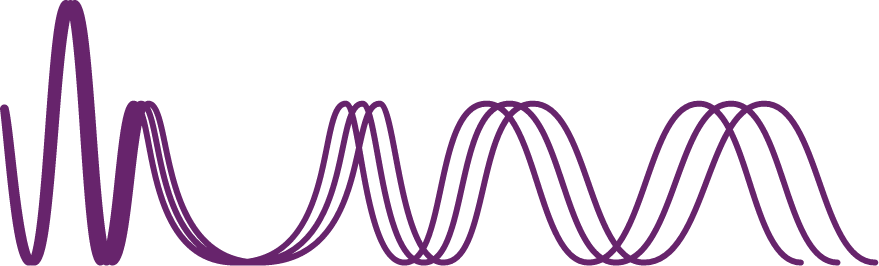

    
    

        
        
PRAVC

        
Prevendo e Previnindo

        
Quatro Cientistas e Um Algoritmo

        
Integrantes: Bruno Ferreira Brischi, Cauê Gomes Correia dos Santos, Gabriela Frajtag, Karla Rovedo Pascoalini

        
Ilum - Escola de ciência

    

